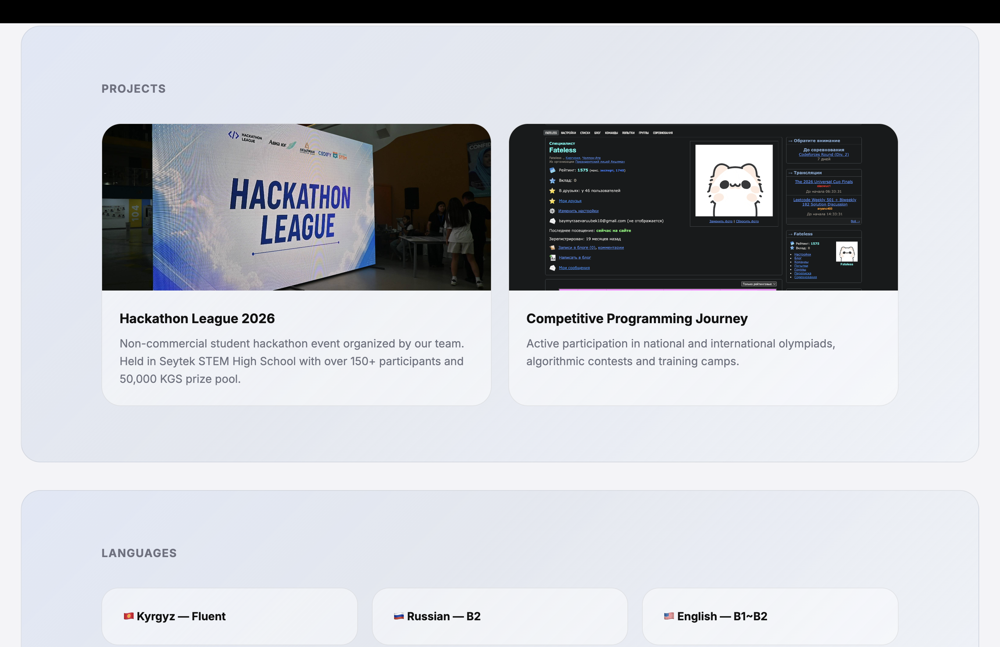

# Portfolio

A modern personal portfolio website built to showcase achievements, programming experience, projects, languages and extracurricular activities.

The website follows a clean white-blue premium UI style with smooth sections, glassmorphism cards and an animated photo carousel.

---

## Features

- Responsive modern design
- Animated horizontal image slider
- White-blue premium UI
- Glassmorphism styled sections
- Smooth scrolling navigation
- Achievement showcase
- Skills section
- Project presentation
- Languages & activities blocks

---

## Achievements

- 🥉 EJOI 2025 Bronze Medalist
- 🥉 VKOSHP 2025 Bronze Medalist
- 🥉 Info(1) Cup 2026 Bronze Medalist
- 🥉 Kyrgyzstan Nationals 2026 Bronze Medalist
- 🥉 IATI 2026 Bronze Medalist

---

## Projects

### Hackathon League 2026
Non-commercial student hackathon organized by our team.

- Held at Seytek STEM High School
- Over 150+ participants
- 50,000 KGS prize pool
- Focused on technology, robotics and innovation

---

## Skills

- Competitive Programming
- C++
- Python
- HTML & CSS
- C#
- Algorithms & Data Structures
- Basic Photo Editing
- Basic Video Editing

---

## Languages

- 🇰🇬 Kyrgyz — Fluent
- 🇷🇺 Russian — B2
- 🇺🇸 English — B1~B2

---

## Activities

- Official school volleyball team player
- DJ assistant
- LED & lighting setup assistant
- Amateur chess player

---

## Technologies Used

- HTML5
- CSS3
- Google Fonts
- Responsive Design
- Flexbox & Grid

---

## Deployment

```bash
https://portfolio-khaki-three-99.vercel.app/
```

---

## Repository

```bash
https://github.com/HackathonLeague/Portfolio
```

---

## Screenshots

Example:


 

---

## Run Locally

Clone the project:

```bash
git clone https://github.com/HackathonLeague/Portfolio/
```

Open `index.html` in browser or use Live Server.

---

## About

This project was created as a personal portfolio website to present programming achievements, hackathon activities and technical skills in a modern and visually appealing format.

Author - Baimyrzaev Aruubek
